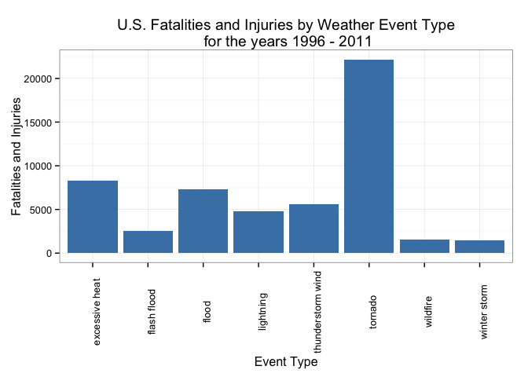
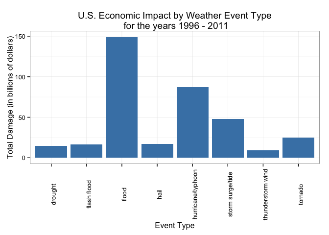

# High Contributors among Storm Events to Fatalities, Injuries, and Damages
Melanie Hardie  

## Synopsis
In this report we aim to identify the leading contributors to death, injury, and damages among storm events. To investigate this inquiry, we obtained storm and weather event data from the U.S. National Oceanic and Atmospheric Administration (NOAA). From these data, we found that between 1996 and 2011, tornados were most harmful to human health, followed by excessive heat and flooding. We also identified floods to be the most costly weather event for the same time period, followed by hurricanes or typhoons and storm surges or tides.


## Data Processing
From the course assignment website, we are provided a [link](https://d396qusza40orc.cloudfront.net/repdata%2Fdata%2FStormData.csv.bz2) to a compressed archive of storm data from the database (data for 1950 to November 2011), which tracks characteristics of major storms and weather events in the United States, including when and where they occur, as well as estimates of any fatalities, injuries, and property damage.

### Reading in the data
We first read in the storm data from the CSV file included in the compressed archive noting that missing values are coded as blank fields.  


```r
# if the zip file cannot be found in this directory, go get it
if (!file.exists("stormData.csv.bz2")) {
    fileUrl <- "https://d396qusza40orc.cloudfront.net/repdata%2Fdata%2FStormData.csv.bz2"
    download.file(fileUrl, destfile = "stormData.csv.bz2", method = "curl")
}
# read in the data
stormdata <- read.csv("stormData.csv.bz2", stringsAsFactors = FALSE, na.strings = "")
```

After reading in the data, we check the dimensions to see that there are 902297 observations in the data set.


```r
dim(stormdata)
```

```
## [1] 902297     37
```

Since we are interested in comparing fatalities, injuries, and damages by the type of weather event, we want to get see what the event type column, which is named `EVTYPE` looks like

```r
length(unique(stormdata$EVTYPE))
```

```
## [1] 985
```

```r
head(unique(stormdata$EVTYPE))
```

```
## [1] "TORNADO"               "TSTM WIND"             "HAIL"                 
## [4] "FREEZING RAIN"         "SNOW"                  "ICE STORM/FLASH FLOOD"
```

We know from the NOAA [documentation](http://www.ncdc.noaa.gov/stormevents/pd01016005curr.pdf) (page 6) that there are 48 event types identified. However, the data we have lists 985 different event types, so we will need to devise a strategy for cleaning up this data. 

### Data Cleaning

Our strategy involves first reducing the data to only the rows we need for our analysis, and then fitting all the event type values into one of the 48 desired categories. From the [database details information page](http://www.ncdc.noaa.gov/stormevents/details.jsp?type=eventtype) of the NOAA website, we can see the periods for which certain event types were recorded. According to this information, the only event types recorded from January 1950 through January 1955 are tornados. Similarly, the database records for the 41 year period from January 1955 to January 1996 contain only information for tornados, thunderstorm wind, and hail events. Keeping this data would skew or results for these event types, so we will first subset our data to include only the records for events that occurred after January 1996.


```r
# convert the event start date to the date class. 
stormdata$BGN_DATE <- as.Date(stormdata$BGN_DATE, format = "%m/%d/%Y %H:%M:%S" )
# Subset according to dates
stormdataSubset <- stormdata[stormdata$BGN_DATE >= "1996-01-01", ]
# check number of event types
length(unique(stormdataSubset$EVTYPE))
```

```
## [1] 516
```

We now have 516 different event types. We will further reduce our data set to include only the columns we need for our analysis and only the rows that report a fatality, injury, or damage.

```r
# specify the columns we need for the analysis
dataCols <- c("EVTYPE","FATALITIES","INJURIES","PROPDMG","PROPDMGEXP","CROPDMG","CROPDMGEXP")

# subset according to the desired columns
stormdataSubset <- stormdataSubset[dataCols]
# specify only the rows we need
stormdataSubset <- subset(stormdataSubset, stormdataSubset$FATALITIES != 0 
          | stormdataSubset$INJURIES != 0
          | stormdataSubset$PROPDMG != 0
          | stormdataSubset$CROPDMG !=0)

# check number of event types
length(unique(stormdataSubset$EVTYPE))
```

```
## [1] 222
```


We now have only 222 event type values and begin our cleaning activities of the column. In our exploration of the data we noticed that there are some duplicate values if we disregard the case of the letters. For example, there may be a value for `hail`, one for `HAIL`, and yet another for `Hail`. We can collapse these into the same value by converting all the letters to lowercase and removing any leading spaces from the values. 


```r
# convert the EVTYPE column values to lowercase
stormdataSubset$EVTYPE <- tolower(stormdataSubset$EVTYPE)
# remove one or more leading spaces from EVTYPE column values
stormdataSubset$EVTYPE <- gsub("^\\s+", "", stormdataSubset$EVTYPE)
# check number of event types
length(unique(stormdataSubset$EVTYPE))
```

```
## [1] 183
```

So there are now 183 different values in `EVTYPE`. We will reduce this number by replacing invalid values by one of the 48 designated event types. Through visual inspection of the event values, we have constructed a mapping of regular expressions to event type. This mapping was stored in a file called `eventFilters.csv`, which we will use to replace the invalid event type values. Please refer to the Supplementary Material section for more detail. 


```r
#read in the csv file
eventMap <- read.csv("eventFilters.csv")
#transpose the rows and columns
eventMap <- t(eventMap)
# convert the matrix to a data frame
eventMap <- as.data.frame(eventMap, stringsAsFactors = FALSE)
# for each mapping expression, find the rows that match the expression 
# and replace the EVTYPE value with the mapping event type
for (mapping in eventMap) {
    stormdataSubset$EVTYPE[grepl(mapping[1],stormdataSubset$EVTYPE,ignore.case=T)] <- mapping[2]
}
# print out the event types
unique(stormdataSubset$EVTYPE)
```

```
##  [1] "winter storm"            "tornado"                
##  [3] "thunderstorm wind"       "high wind"              
##  [5] "flash flood"             "sleet"                  
##  [7] "extreme cold/wind chill" "lightning"              
##  [9] "hail"                    "flood"                  
## [11] "excessive heat"          "rip current"            
## [13] "other"                   "heavy snow"             
## [15] "wildfire"                "ice storm"              
## [17] "blizzard"                "storm surge/tide"       
## [19] "dust storm"              "strong wind"            
## [21] "dust devil"              "dense fog"              
## [23] "high surf"               "heavy rain"             
## [25] "avalanche"               "frost/freeze"           
## [27] "coastal flood"           "waterspout"             
## [29] "hurricane/typhoon"       "tropical storm"         
## [31] "cold/wind chill"         "winter weather"         
## [33] "drought"                 "coastal flooding"       
## [35] "debris flow"             "freezing fog"           
## [37] "heat"                    "lake-effect snow"       
## [39] "funnel cloud"            "seiche"                 
## [41] "volcanic ash"            "marine tstm wind"       
## [43] "astronomical high tide"  "tropical depression"    
## [45] "marine high wind"        "tsunami"                
## [47] "lakeshore flood"         "astronomical low tide"  
## [49] "dense smoke"             "marine hail"
```

From the print out above, we see that there are still 50 unique values in the `EVTYPE` column. Visually comparing these to the types listed in the NOAA documentation, we identify the 2 two invalid types as 'astronomical high tide' and 'other'. In order to recategorize theses records we need to manually review the `REMARKS` field for each record and assign to it the proper event type. We have created two files: `hightide.csv` and `other.csv` that each contain a single column of data. The column entries are the proper event types, which we will reassign to the column. Please refer to the Supplementary Material section for more detail. 


```r
#read in the files
hightide <- read.csv("hightide.csv", header = FALSE)
other <- read.csv("other.csv", header = FALSE)
hightide <- as.vector(hightide[,1])
other <- as.vector(other[,1])
# replace the values
stormdataSubset$EVTYPE[grepl('astronomical high tide',stormdataSubset$EVTYPE,ignore.case=T)] <- hightide
stormdataSubset$EVTYPE[grepl('other',stormdataSubset$EVTYPE,ignore.case=T)] <- other
# check number of event types
length(unique(stormdataSubset$EVTYPE))
```

```
## [1] 48
```

Notice now that we have the correct number of event types! 

In order to obtain the results for injuries and fatalities, we are able to use the values from the `FATALITIES` and `INJURIES` columns directly. However, in order to analyse damages resulting from weather events we will need the data for damage to property and crops, which are coded in 4 columns: `PROPDMG`, `PROPDMGEXP`, `CROPDMG`, and `CROPDMGEXP`. According to the documentation, the `PROPDMGEXP` and `CROPDMGEXP` values encode a multiplier to apply to the `PROPDMGEXP` and `CROPDMG`, respectively. Let's see what values the multiplier columns can take.


```r
unique(stormdataSubset$PROPDMGEXP)
```

```
## [1] "K" NA  "M" "B"
```

```r
unique(stormdataSubset$CROPDMGEXP)
```

```
## [1] "K" NA  "M" "B"
```

We use the NOAA [query engine](http://www.ncdc.noaa.gov/stormevents/choosedates.jsp?statefips=-999%2CALL) to determine that [K,M,B,NA] values map to the multipliers [1000,1000000,1000000000,0]. We will use these multipliers to calculate the total damage for event record and add the total as a column to the data set.


```r
# replace the values in PROPDMGEXP and CROPDMGEXP with the multiplier
stormdataSubset$PROPDMGEXP[is.na(stormdataSubset$PROPDMGEXP)] <- 0
stormdataSubset$CROPDMGEXP[is.na(stormdataSubset$CROPDMGEXP)] <- 0
stormdataSubset$PROPDMGEXP[grep("K", stormdataSubset$PROPDMGEXP)] <- 1000
stormdataSubset$CROPDMGEXP[grep("K", stormdataSubset$CROPDMGEXP)] <- 1000
stormdataSubset$PROPDMGEXP[grep("M", stormdataSubset$PROPDMGEXP)] <- 1000000
stormdataSubset$CROPDMGEXP[grep("M", stormdataSubset$CROPDMGEXP)] <- 1000000
stormdataSubset$PROPDMGEXP[grep("B", stormdataSubset$PROPDMGEXP)] <- 1000000000
stormdataSubset$CROPDMGEXP[grep("B", stormdataSubset$CROPDMGEXP)] <- 1000000000
# convert the columns to numeric
stormdataSubset$PROPDMGEXP <- as.numeric(stormdataSubset$PROPDMGEXP)
stormdataSubset$CROPDMGEXP <- as.numeric(stormdataSubset$CROPDMGEXP)
# verify the replacments have been made
unique(stormdataSubset$PROPDMGEXP)
```

```
## [1] 1e+03 0e+00 1e+06 1e+09
```

```r
unique(stormdataSubset$CROPDMGEXP)
```

```
## [1] 1e+03 0e+00 1e+06 1e+09
```

```r
# calculate the total damage for each record
stormdataSubset$totaldamage <- (stormdataSubset$PROPDMG * stormdataSubset$PROPDMGEXP) + (stormdataSubset$CROPDMG * stormdataSubset$CROPDMGEXP)
# verify the column has been added
head(stormdataSubset$totaldamage)
```

```
## [1] 418000 100000   3000   5000   2000 400000
```

Now we're ready to begin our analysis.


## Results
### High Contributors to Fatalities and Injuries
The first part of our investigation involves determining which types of events are most harmful with respect to population health. The data we will use to answer this query is contained in the `FATALITIES` and `INJURIES` columns. Since we have not been given any metric or relative weight to compare the harmfulness of a fatality to an injury, we will simply add the two counts together and store them in a new column named totalharm. 


```r
# add injuries and fatalities and store in a new column
stormdataSubset$totalharm <- stormdataSubset$FATALITIES + stormdataSubset$INJURIES
# group by event type
totalharmByEvent <- aggregate(stormdataSubset$totalharm ~ stormdataSubset$EVTYPE, FUN = sum, na.rm=TRUE)
colnames(totalharmByEvent) <- c("Event Type", "Fatalities and Injuries")
# reorder the table by totalharm decreasing
totalharmByEvent <- totalharmByEvent[order(totalharmByEvent$`Fatalities and Injuries`, decreasing = TRUE),]
# show the top 6 harmful event types and totals
head(totalharmByEvent)
```

```
##           Event Type Fatalities and Injuries
## 40           tornado                   22178
## 13    excessive heat                    8260
## 16             flood                    7279
## 39 thunderstorm wind                    5572
## 30         lightning                    4792
## 15       flash flood                    2561
```

Tornados are clearly the most harmful weather event with respect to population health. Let's see what percentage this represents:


```r
tornadoHarm <- totalharmByEvent[1,]$`Fatalities and Injuries`
totalharm <- sum(totalharmByEvent$`Fatalities and Injuries`)
tornadoHarm/totalharm
```

```
## [1] 0.3324689
```

So, tornados cause approximately 1/3 of all injuries and fatalities caused by weather events. To compare visually, here are the 8 highest contributors:


```r
# identify the top 8 most harmful event types
harmHighest <- totalharmByEvent[1:8,]
# make a barplot of the top 8 events
library(ggplot2)
ggplot(harmHighest, aes(`Event Type`, `Fatalities and Injuries`)) + geom_bar(fill="steelblue",stat="identity") + theme_bw()+ theme(axis.text.x = element_text(angle = -270)) + labs(title="U.S. Fatalities and Injuries by Weather Event Type\n for the years 1996 - 2011")
```

 

From the plot above we can see that of the top 8 contributors, tornados are most harmful to human health by a significant margin, followed by excessive heat and flooding.


### High Contributors to Damages
We would also like to explore which types of events have the greatest economic consequences. Again we will group by event type.


```r
# group by event type
totaldamageByEvent <- aggregate(stormdataSubset$totaldamage ~ stormdataSubset$EVTYPE, FUN = sum, na.rm=TRUE)
colnames(totaldamageByEvent) <- c("Event Type", "Total Damage")
# reorder the table by totaldamage decreasing
totaldamageByEvent <- totaldamageByEvent[order(totaldamageByEvent$`Total Damage`, decreasing = TRUE),]
# show the top 6 costly event types and totals
head(totaldamageByEvent)
```

```
##           Event Type Total Damage
## 16             flood 148986410700
## 26 hurricane/typhoon  87068996810
## 37  storm surge/tide  47835629000
## 40           tornado  24900377720
## 20              hail  17092035870
## 15       flash flood  16557170610
```

So, we see that flooding is the most costly weather event in terms of combined damages. To plot the data, we will divide the totals by a factor of a billion:


```r
# divide totaldamages by a billion
totaldamageByEvent$`Total Damage` <- totaldamageByEvent$`Total Damage`/1000000000
# identify the top 8 most costly event types
damageHighest <- totaldamageByEvent[1:8,]
# make a barplot of the top 8 events
library(ggplot2)
ggplot(damageHighest, aes(`Event Type`, `Total Damage`)) + geom_bar(fill="steelblue",stat="identity") + theme_bw()+ theme(axis.text.x = element_text(angle = -270)) + labs(title="U.S. Economic Impact by Weather Event Type\n for the years 1996 - 2011", y="Total Damage (in billions of dollars)")
```

 

From the plot above we can see that of the top 8 contributors, flooding is the most costly, followed by hurricanes or typhoons and storm surges or tides.


## Supplementary Material

### Event Filters

The content of the `eventFilters.csv` file was derived by visually inspecting the event types and creating a regular expression to select the invalid categories. This data could have been hard coded into the r code for this report, but was saved to a file instead to reduce document bulk.

The following is the contents of the `eventFilters.csv`, which can be used to reproduce the results obtained in this report. To create the file, copy the text below, paste it into a text editor and hit return to ensure there is a new line character after the last line of data. Save this file as `eventFilters.csv`.

expression,event  
^tstm wind|^gusty thunderstorm|burst|thunderstorm,thunderstorm wind  
surf|marine accident|high swells|heavy seas|high seas|rough seas|rogue  
^wind|^gusty|^high wind|non-severe wind damage|non-tstm wind|non tstm wind,high wind  
wave,high surf  
flash,flash flood  
coastal(\\s+)?flood|eros|river|tidal|dam break|coastalstorm,coastal flood  
^fog|dense fog,dense fog  
^hail|small hail,hail  
fire,wildfire  
^excessive heat|record heat|heat wave,excessive heat  
warm,heat  
hurricane|typhoon,hurricane/typhoon  
heavy snow,heavy snow  
freezing rain|mixed precip,sleet  
extreme cold|extreme windchill,extreme cold/wind chill  
rip,rip current  
surge|coastal storm,storm surge/tide  
ice jam|urban,flood  
frost|freeze,frost/freeze  
^cold|unseasonab|extended|exposure,cold/wind chill  
winter weather|wintry mix|icy roads|black ice|ice roads|ice on road,winter weather  
rain|high water|drowning,heavy rain  
slump|slide,debris flow  
whirlwind|blowing dust,dust devil  
gradient|strong wind,strong wind  
freezing|glaze,freezing fog  
lake[ |-],les  
[heavy|excessive] snow,hvsn  
snow,winter weather  
^les,lake-effect snow  
^hvsn,heavy snow  
landspout,tornado  


### 'Astronomical High Tide' Value Coding

The `REMARKS` field was inspected for records where the value of `EVTYPE` is 'astronomical high tide' and valid event type manually recorded to the `hightide.csv` file. This data could have been hard coded into the r code for this report, but was saved to a file instead to reduce document bulk.

The following is the contents of the `hightide.csv` file, which can be used to reproduce the results obtained in this report. To create the file, copy the text below, paste it into a text editor and hit return to ensure there is a new line character after the last line of data. Save this file as `hightide.csv`.

winter storm  
winter storm  
coastal flood  
tropical storm  
high surf  
coastal flood  
coastal flood  
high surf  


### 'Other' Value Coding

The `REMARKS` field was inspected for records where the value of `EVTYPE` is 'other' and valid event type manually recorded to the `hightide.csv` file. This data could have been hard coded into the r code for this report, but was saved to a file instead to reduce document bulk.

The following is the contents of the `other.csv` file, which can be used to reproduce the results obtained in this report. To create the file, copy the text below, paste it into a text editor and hit return to ensure there is a new line character after the last line of data. Save this file as `other.csv`.

heavy snow  
dust devil  
heavy rain  
heavy rain  
heavy rain  
heavy rain  
heavy rain  
heavy rain  
heavy rain  
heavy rain  
heavy rain  
heavy rain  
heavy rain  
heavy rain  
heavy rain  
heavy rain  
heavy rain  
heavy rain  
heavy rain  
heavy rain  
heavy rain  
heavy rain  
heavy rain  
heavy rain  
heavy rain  
heavy rain  
heavy rain  
heavy rain  
heavy rain  
heavy rain  
heavy rain  
heavy rain  
dust devil  
dust devil  

### Software Environment
Modified output from `sessionInfo()`
R version 3.2.1 (2015-06-18)  
Platform: x86_64-apple-darwin13.4.0 (64-bit)  
Running under: OS X 10.10.5 (Yosemite)  

locale:  
en_CA.UTF-8/en_CA.UTF-8/en_CA.UTF-8/C/en_CA.UTF-8/en_CA.UTF-8

attached base packages:  
stats     
graphics  
grDevices utils  
datasets  
methods  
base

other attached packages:
ggplot2_1.0.1

loaded via a namespace (and not attached): 
Rcpp_0.12.1  
digest_0.6.8  
MASS_7.3-44  
grid_3.2.1  
plyr_1.8.3  
gtable_0.1.2  
magrittr_1.5  
scales_0.3.0  
stringi_0.5-5  
reshape2_1.4.1  
rmarkdown_0.8.1  
proto_0.3-10  
labeling_0.3  
tools_3.2.1  
stringr_1.0.0  
munsell_0.4.2  
colorspace_1.2-6  
htmltools_0.2.6  
yaml_2.1.13  
